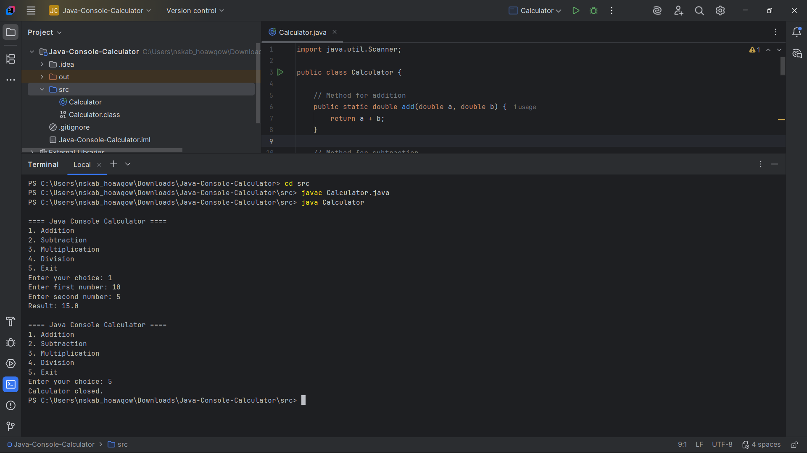

# Java Console Calculator

## Project Description
This is a simple console-based calculator built using Java for a Java Developer Internship task.
It performs basic arithmetic operations such as addition, subtraction, multiplication, and division.

## Features
- Addition
- Subtraction
- Multiplication
- Division
- Handles divide-by-zero
- Runs continuously until the user exits

## Technologies Used
- Java (JDK)
- Scanner class
- Methods
- Loops
- Conditional statements

## How to Run

1. Open project in IntelliJ IDEA
2. Compile and run `Calculator.java`
3. Follow the menu options in the console

## Example

--- Java Console Calculator ---
1. Add
2. Subtract
3. Multiply
4. Divide
5. Exit

Choose option: 1
Enter first number: 10
Enter second number: 5

Result = 15

## Program Output

